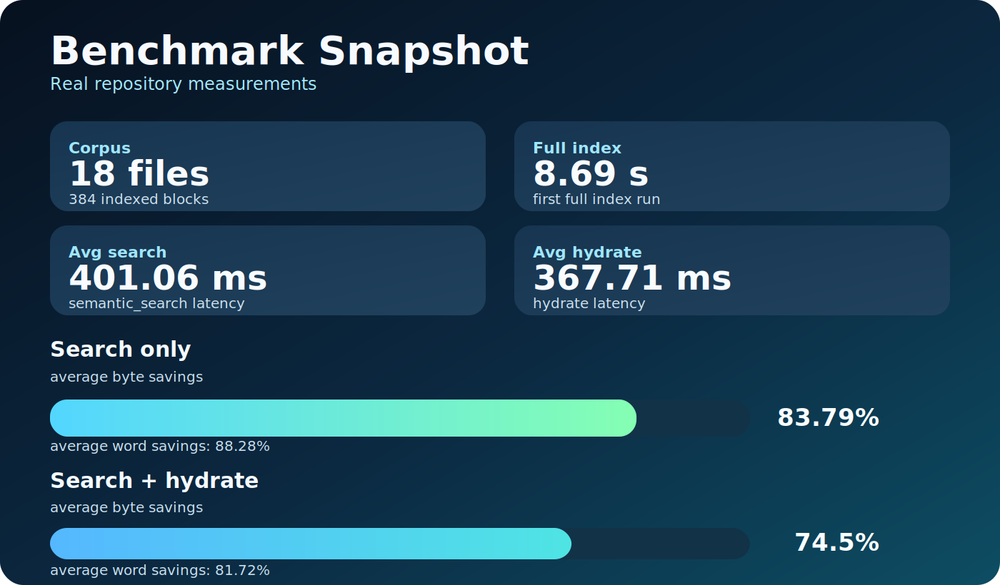

# Turbo Quant Memory for AI Agents


[](https://github.com/Lexus2016/turbo_quant_memory/releases)
[](https://www.python.org/downloads/)
[](https://modelcontextprotocol.io/)
[](https://github.com/Lexus2016/turbo_quant_memory)

Other languages: [Russian](README.ru.md) | [Ukrainian](README.uk.md)

Turbo Quant Memory is the memory layer that makes AI agents feel like long-term teammates instead of short-term chat sessions.

If you use Claude Code, Codex, Cursor, OpenCode, Gemini CLI, or any MCP client, this is how you keep your institutional knowledge alive between tasks.

## Why It Matters

Most agent workflows fail in the same place: memory.

- Great insights disappear in chat history.
- Every new task restarts from zero.
- Teams re-explain the same architecture again and again.

Turbo Quant Memory fixes this by making your project knowledge persistent, searchable, and reusable.

## Why Teams Choose Turbo Quant Memory

| Typical AI workflow | With Turbo Quant Memory |
|---|---|
| Agents forget context between sessions | Agents can continue from saved project knowledge |
| Decisions stay buried in old threads | Decisions become reusable notes |
| Team knowledge stays inside one person's head | Knowledge becomes shared, searchable, and portable |
| Token budget is wasted on repeated reading | Context is loaded smarter, so more budget goes to reasoning |

## The Core Promise

Your agents stop behaving like temporary assistants and start behaving like members of the team.

## What Makes It Different

- Local-first by design: your memory stays under your control.
- One memory layer for many clients: same knowledge, same standards, same outcomes.
- Cross-agent continuity: start in Codex, continue in Gemini CLI, come back to Codex, and keep the same project memory.
- Built for real delivery: capture decisions, patterns, and handoffs that compound over time.
- Transparent and auditable: memory is explicit, structured, and easy to inspect.

## Quick Start

Use this 60-second flow:

1. Install once:
```bash
uv tool install git+https://github.com/Lexus2016/turbo_quant_memory@v0.4.2
```

2. Add `tqmemory` MCP server in your client (the client will launch it automatically):

```bash
# Codex
codex mcp add tqmemory -- turbo-memory-mcp serve

# Gemini CLI
gemini mcp add tqmemory turbo-memory-mcp serve

# Claude Code (project scope)
claude mcp add --scope project tqmemory -- turbo-memory-mcp serve
```

3. Restart the client and run any `tqmemory` tool.

Need a ready config for Gemini CLI, Cursor, OpenCode, or Antigravity? Use [CLIENT_INTEGRATIONS.md](CLIENT_INTEGRATIONS.md).

### Upgrading

To pull a new release into an existing install, re-run the install command with `--reinstall`:

```bash
uv tool install --reinstall git+https://github.com/Lexus2016/turbo_quant_memory@v0.4.2
```

If you already have `~/.gemini/settings.json` from before v0.4.2, also merge this block once so Gemini CLI starts reading `AGENTS.md` alongside `GEMINI.md`:

```jsonc
{
  "context": { "fileName": ["AGENTS.md", "GEMINI.md"] }
}
```

## Ignoring Files During Indexing

Create a `.tqmemoryignore` file in your project root to exclude directories or files from Markdown indexing. The format is similar to `.gitignore` — one glob pattern per line, `#` for comments.

```gitignore
# Skip duplicate workspace template directories
workspace-*

# Skip runtime reports
data/reports/*.md

# Skip generated content
output/
```

The ignore file is picked up automatically by `index_paths(...)`. Patterns match against both directory names and full relative paths. The search walks upward from the indexed root until it finds a `.tqmemoryignore` or reaches the `.git` boundary.

Directories like `node_modules`, `.git`, `__pycache__`, `dist`, and `build` are always ignored by default.

## Shared Memory Across Agents

This works out of the box in the standard local setup. You do not need a separate sync service, export/import flow, or agent-specific memory configuration.

This is shared local memory, not remote cloud sync. If Codex and Gemini CLI run on the same machine and open the same repository, they can use the same memory layer automatically.

To keep one shared project memory across Codex, Gemini CLI, and other MCP clients:

1. Install `turbo-memory-mcp` once on the machine.
2. Add the same `tqmemory` MCP server in each client you use.
3. Open the same repository in each client.

When those conditions are true, the clients resolve the same project memory automatically. That means you can start work in Codex, continue in Gemini CLI, and return to Codex without rebuilding context.

If a client is launched outside the repository root, set `TQMEMORY_PROJECT_ROOT` explicitly so it resolves the same project identity.

## Who This Is For

- AI-first engineering teams
- Solo builders running multiple agents
- Product teams that want consistent AI execution quality
- Anyone tired of repeating context every day

## Why Pick This

Choose Turbo Quant Memory if you want:

- faster onboarding for every new task
- fewer repeated mistakes
- stronger continuity across sessions
- higher ROI from every agent run

## Benchmark-Proven Cost Advantage



On this repository corpus, the compact memory path shows strong savings that directly reduce model spend:

- `semantic_search` only: **63.96% fewer bytes** sent to the model on average
- `semantic_search + hydrate(top1)`: **44.1% fewer bytes** on average
- `semantic_search` latency: **68.13 ms** average
- `hydrate` latency: **41.63 ms** average

Why this is a practical advantage:

- less repeated reading means fewer billed input tokens
- lower token pressure means lower cost per task
- context budget stays available for reasoning instead of reloading files

## New In v0.4.2

- Gemini CLI fixture and the bundled `.gemini/settings.json` now ship `"context": {"fileName": ["AGENTS.md", "GEMINI.md"]}`, so Gemini CLI picks up the same `AGENTS.md` project prompts the rest of the agents already use — no duplicate `GEMINI.md` mirror required.
- README and SMOKE checklist install commands now point at the actual current release, with a new `Upgrading` subsection covering `uv tool install --reinstall` and the one-time `~/.gemini/settings.json` migration.
- New SMOKE checklist step warns operators that merging the Gemini fixture into an existing `settings.json` must preserve the `context` block — without it Gemini CLI silently falls back to `GEMINI.md`-only and skips `AGENTS.md`.
- Filed `.planning/todos/2026-04-28-lint-false-positives.md` tracking two `lint_knowledge_base` issues for the next code release: ASCII-only title-key normalization that collapses Cyrillic / non-ASCII H1s into `untitled`, and `broken_link` reports for files inside `DEFAULT_IGNORED_DIR_NAMES` (e.g. `benchmarks/latest.md`) that exist on disk.

## New In v0.4.1

- Automatic proxy failover when the primary dies. Previously, if the first `turbo-memory-mcp` process (the primary holding the model + LanceDB handles) shut down, the remaining proxy processes in other MCP clients lost their RPC link and `tqmemory` became silently unavailable for those clients.
- Proxies now detect a lost primary via `PrimaryUnreachable` on their next RPC call and transparently re-bootstrap: one surviving proxy atomically claims the lockfile and promotes itself to primary (starting its own `DaemonListener`), and every other orphaned proxy reconnects to the new primary. No MCP client restart required.
- Phase-aware RPC error handling: connect/send-phase failures are translated into `PrimaryUnreachable` (safe to replay), while mid-call failures (send succeeded, recv failed) surface to the host unchanged so non-idempotent tools like `remember_note` are never silently duplicated.
- Gemini CLI fixture now ships `context.fileName: ["AGENTS.md", "GEMINI.md"]` so Gemini CLI picks up the same `AGENTS.md` project prompts that Codex, Cursor, and other agents already use, without forcing a duplicate `GEMINI.md` mirror file.

## New In v0.4.0

- Singleton daemon transport: only one `turbo-memory-mcp` process per machine keeps the sentence-transformers model and LanceDB handles resident. Every additional MCP-client launch becomes a thin stdio↔socket proxy that forwards tool calls to the primary.
- Cross-platform coordination: Unix/macOS uses an `AF_UNIX` socket under the system temp dir (short path, 0600 perms); Windows uses a named pipe scoped to the current user. Authenticated via a 32-byte random authkey stored in `~/.turbo-quant-memory/.daemon.lock`.
- Lazy imports in `retrieval_index` mean proxy processes do not pay the ~470 MB cost of PyTorch / LanceDB / PyArrow imports when they only forward RPC. Measured savings: ~1 GB RSS for four concurrent MCP clients (primary 530 MB, proxies ~50 MB each vs 437 MB each before).
- Existing on-disk state (JSON notes, LanceDB tables, Markdown blocks, manifests) is unchanged and fully backward-compatible. Escape hatch: set `TQMEMORY_DAEMON_DISABLE=1` to fall back to per-process mode.

## New In v0.3.1

- Published shared-memory guidance for Codex and Gemini CLI handoffs inside the README and client integration docs.
- Added a ready Gemini CLI fixture plus smoke-check steps for validating the same `tqmemory` server across clients.
- Clarified that shared memory is local same-machine continuity, not remote cloud sync.

## Learn More

- Client integrations: [CLIENT_INTEGRATIONS.md](CLIENT_INTEGRATIONS.md)
- Technical spec: [TECHNICAL_SPEC.md](TECHNICAL_SPEC.md)
- Memory strategy: [MEMORY_STRATEGY.md](MEMORY_STRATEGY.md)
- Benchmarks: [benchmarks/latest.md](benchmarks/latest.md)
