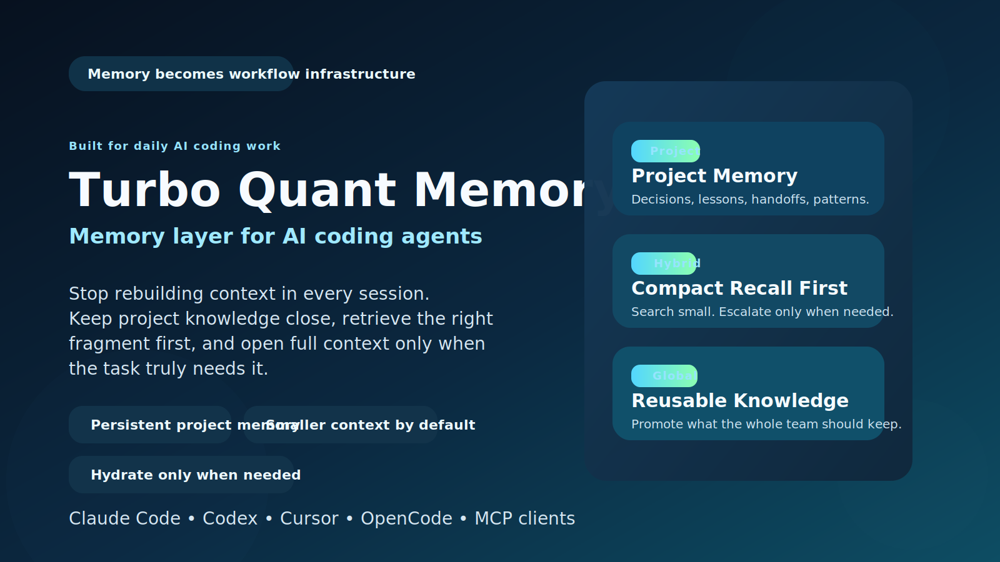

# Turbo Quant Memory for AI Agents



Other languages: [Russian](README.ru.md) | [Ukrainian](README.uk.md)

AI coding tools are fast. Their memory is not.

Turbo Quant Memory gives Claude Code, Codex, Cursor, and other MCP clients a durable memory layer so they stop paying the same context tax again and again.

If you use AI agents every day, memory stops being a nice extra and becomes part of your core workflow.

## Why This Matters

Without a memory layer, teams keep paying for the same problems:

- agents re-read too much source material before they can act
- earlier decisions disappear between sessions
- useful lessons stay trapped in old chats
- every new task starts by rebuilding context from scratch

Turbo Quant Memory turns that repeated overhead into reusable infrastructure.

## What You Get

- Smaller default context: compact retrieval first, fuller context only when you explicitly ask for it
- Persistent project memory: decisions, lessons, handoffs, and repeatable patterns
- Reusable knowledge: promote proven notes from the current project into a global namespace
- Local control: data stays on your machine under `~/.turbo-quant-memory/`
- Operator visibility: health checks, storage stats, freshness status, and smoke validation
- Multi-client support: one MCP server for Claude Code, Codex, Cursor, OpenCode, and more

## The Product Pitch in One Sentence

Turbo Quant Memory helps AI coding agents remember what matters, retrieve less by default, and escalate to full context only when the task really needs it.

## Why Teams Keep It

- It reduces repeated context loading.
- It makes agent sessions feel less stateless.
- It gives important project knowledge a durable home outside chat history.
- It keeps retrieval structured instead of turning every task into a full-file dump.
- It gives you a memory workflow you can inspect, test, and trust.

## Proof From This Repository

The repository includes a real benchmark run in [benchmarks/latest.md](benchmarks/latest.md) and [benchmarks/latest.json](benchmarks/latest.json).

Current benchmark snapshot:

- Corpus size: 117 Markdown files, 1015 indexed blocks
- Full index time: 17.11 s
- Idle incremental time: 2.32 s
- Average `semantic_search` latency: 544.08 ms
- Average `hydrate` latency: 184.49 ms
- Average byte savings with `semantic_search` only: 78.39%
- Average byte savings with `semantic_search + hydrate(top1)`: 66.46%
- Average word savings with `semantic_search` only: 83.25%
- Average word savings with `semantic_search + hydrate(top1)`: 74.98%

What those numbers mean:

- the default retrieval path is much smaller than opening full source files
- even after hydrating the top hit, the guided path still stays materially smaller than the naive path
- you keep more context budget for actual reasoning instead of spending it on repeated file reads

Benchmark method:

- Baseline without guided memory: open the full source text of every unique Markdown file represented in the top-5 project search hits
- Compact path: keep only the `semantic_search` response
- Guided path: use `semantic_search` and then `hydrate` the top Markdown hit

These are real measurements for this repository and this implementation. They are not a universal guarantee for every codebase.

## Install

Recommended release install from GitHub tag:

```bash
uv tool install git+https://github.com/Lexus2016/turbo_quant_memory@v0.2.0
turbo-memory-mcp serve
```

`pip` fallback:

```bash
python -m pip install git+https://github.com/Lexus2016/turbo_quant_memory@v0.2.0
turbo-memory-mcp serve
```

Developer setup from source:

```bash
uv sync
uv run turbo-memory-mcp serve
```

Editable `pip` setup from source:

```bash
python -m venv .venv
. .venv/bin/activate
pip install -e .
python -m turbo_memory_mcp serve
```

## Connect a Client

Server id:

- `tqmemory`

Runtime command:

- `turbo-memory-mcp serve`

Quick examples:

- Claude Code: `claude mcp add --scope user tqmemory -- turbo-memory-mcp serve`
- Codex: `codex mcp add tqmemory -- turbo-memory-mcp serve`

After you install the MCP server and connect it to the client, memory becomes part of the agent's toolset.

You do not need to run separate commands, open a second window, or manually turn memory on for each task.

From that point on, you just talk to the agent normally. When memory is relevant, the agent can call `tqmemory` automatically.

If you want to be explicit, you can still say "use project memory" or mention `tqmemory`, but that is optional, not required.

Ready-made client fixtures:

- [examples/clients/claude.project.mcp.json](examples/clients/claude.project.mcp.json)
- [examples/clients/codex.config.toml](examples/clients/codex.config.toml)
- [examples/clients/cursor.project.mcp.json](examples/clients/cursor.project.mcp.json)
- [examples/clients/opencode.config.json](examples/clients/opencode.config.json)
- [examples/clients/antigravity.mcp.json](examples/clients/antigravity.mcp.json)

Smoke checklist:

- [examples/clients/SMOKE_CHECKLIST.md](examples/clients/SMOKE_CHECKLIST.md)

## What to Tell Codex

You do not talk to the MCP server with shell commands.

You talk to Codex in normal language, and Codex calls the MCP tools when needed.

The important part is this: after MCP is connected, you do not need a special activation phrase for every task.

In normal use, you simply describe the task. If memory can help, Codex should use it automatically.

Good prompt patterns:

1. First time in a repository

```text
Index this repository and tell me what memory is now available for future tasks.
```

2. Before changing code

```text
Before you edit anything, check this project's memory for previous decisions about auth, sessions, and retries, then summarize the important points.
```

3. When you want Codex to find the right source first

```text
Find the payment webhook flow in this project, open the most relevant memory hit, and explain what the current implementation does.
```

4. When you want to save a decision

```text
Save a decision note titled "Webhook retry policy" with the summary of the approach we just agreed on.
```

5. When you want reusable knowledge, not just project-local memory

```text
If the note we just created is reusable across projects, promote it to global memory.
```

6. When you want a full workflow in one request

```text
Search for everything relevant to caching in this repository, open the best result, then propose the code change using that context.
```

7. When you want to be explicit, but still write like a normal person

```text
Use project memory before you answer. Search for earlier decisions about caching and retries, then continue with the change.
```

## Simple Human Workflow

- Install the MCP server once and connect it to your agent.
- After that, work with Codex normally. You describe the task, and memory can be used automatically in the background.
- On a new repository, it is still useful to ask for an initial index so the memory has something to search.
- Before risky edits, you can ask the agent to check project memory first.
- After important decisions, ask the agent to save them so future sessions do not lose them.

In practice, the easiest mental model is this:

- `semantic_search` is for finding
- `hydrate` is for opening
- `remember_note` is for saving
- `promote_note` is for reusing later
- `deprecate_note` is for retiring stale memory without deleting history

## When Memory Gets Outdated

- Save the new correct knowledge as a fresh note.
- Use `deprecate_note` on the old note when it should stop appearing in active search.
- If the old note has a direct replacement, pass the replacement note id so the old record becomes `superseded` instead of just archived.
- This keeps history available for audit while making `semantic_search` prefer the current truth.

## Technical Details

Namespace model:

- `project`: repository-local notes for the current codebase
- `global`: reusable notes promoted explicitly from `project`
- `hybrid`: merged retrieval across `project` and `global` with a strong project bias

Current project resolution order:

1. Normalized `origin` remote URL
2. Repository root path hash when no remote exists
3. Explicit overrides through `TQMEMORY_PROJECT_ROOT`, `TQMEMORY_PROJECT_ID`, and `TQMEMORY_PROJECT_NAME`

Tool catalog:

- `health`
- `server_info`
- `list_scopes`
- `self_test`
- `remember_note`
- `promote_note`
- `deprecate_note`
- `semantic_search`
- `hydrate`
- `index_paths`

Storage location:

- `~/.turbo-quant-memory/`

Repository verification commands:

```bash
uv run pytest -q
uv run python scripts/smoke_test.py
uv run python scripts/benchmark_context_savings.py
```

## Limits and Reality Check

- This project does not claim direct KV-cache control over hosted models.
- The first embedding-backed run may download `sentence-transformers/all-MiniLM-L6-v2` if the local cache is cold.
- The benchmark report measures this repository and this implementation, not every possible deployment.

## Repository Map

- Runtime contract and server entry point: [src/turbo_memory_mcp/server.py](src/turbo_memory_mcp/server.py)
- Hydration logic: [src/turbo_memory_mcp/hydration.py](src/turbo_memory_mcp/hydration.py)
- Storage model: [src/turbo_memory_mcp/store.py](src/turbo_memory_mcp/store.py)
- Benchmark script: [scripts/benchmark_context_savings.py](scripts/benchmark_context_savings.py)
- Technical specification: [TECHNICAL_SPEC.md](TECHNICAL_SPEC.md)
- Memory strategy: [MEMORY_STRATEGY.md](MEMORY_STRATEGY.md)
