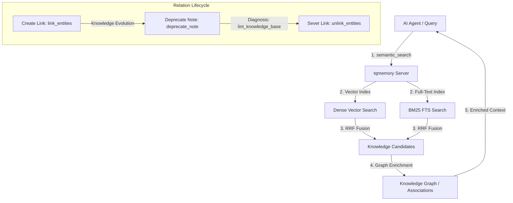

# 🧠 Turbo Quant Memory for AI Agents (v0.6.1)

> **The first self-installable, trilingual local-first memory & knowledge graph for AI coding agents.** Save up to 60% of your token budget while giving your AI assistant a permanent, hyper-fast, and highly connected brain.

---

## 👋 What is this awesome tool? (For Humans)

Imagine you are working with an AI coding assistant (like Claude Code, Gemini CLI, Cursor, or Codex). Every time you restart a session, the AI forgets everything. It forgets your architectural decisions, custom styling rules, how you solved that tricky database bug, or even your coding preferences. You have to explain it all over again, or feed the AI huge files, which **wastes your time and burns through your token budget (costing you real money)**.

**Turbo Quant Memory** solves this once and for all. It is a local-first **Model Context Protocol (MCP) server** that gives your AI agents a persistent brain. It stores:
* 🎯 **Decisions & Lessons**: Why things were built this way, so the AI doesn't break them.
* 💡 **Patterns & Gotchas**: Reusable tricks and hard-won bug fixes.
* 🕸️ **Knowledge Graph Relations**: Structured associations linking memory notes, source files, tasks, or bugs.
* 📦 **Codebase Index**: Compact Markdown block search so the AI understands your project structure instantly.

### 💰 Cost-Saving Magic
Instead of reading massive files every time, your AI agent uses **Compact Retrieval** to query its memory and fetch only highly-relevant 600-token summaries.

| Metric | Value | Benefit for You |
| :--- | :--- | :--- |
| **Context Savings** | 📉 **~63.96% fewer bytes** | Reduced API costs, longer context windows |
| **Search Latency** | ⚡ **<70 ms** | Instant AI responses with zero lag |
| **Architectural Focus** | 🎯 **Dynamic Pruning** | AI sees only what matters, ignoring session noise |
| **Linked Knowledge** | 🕸️ **Knowledge Graph** | AI understands relationships between code, tasks, and decisions |
| **Self-Cleaning Graph** | 🔄 **Dynamic Lifecycle** | Stale relationships are deprecated or unlinked automatically |

---

## 🚀 DON'T INSTALL THIS MANUALLY! (Let the AI Do It)

You don't need to type commands in the terminal or configure JSON files. **Let your AI assistant handle the setup!**

Simply copy the link to this repository:
`https://github.com/Lexus2016/turbo_quant_memory`

And send this exact prompt to your AI assistant (Claude Code, Gemini CLI, Codex, etc.):

> "Hey! Please install and configure the Turbo Quant Memory server for my workspace using this repository: https://github.com/Lexus2016/turbo_quant_memory. Read the README.md, follow the 'Instructions for AI Agents' at the bottom of the file to install it via `uv tool`, register the `tqmemory` MCP server, run health checks, index this project, and set up our persistent memory. Let me know when you're ready!"

Your AI agent will automatically clone, install, register, and index everything for you!

---

## 🛠️ Quick Start (If You *Really* Want to Do It Yourself)

If you prefer the manual way, run this 60-second flow:

1. **Install the CLI Tool:**
   ```bash
   uv tool install git+https://github.com/Lexus2016/turbo_quant_memory@v0.6.1
   ```

2. **Add `tqmemory` MCP Server to your client:**
   ```bash
   # Codex
   codex mcp add tqmemory -- turbo-memory-mcp serve

   # Gemini CLI
   gemini mcp add tqmemory turbo-memory-mcp serve

   # Claude Code (Project scope)
   claude mcp add --scope project tqmemory -- turbo-memory-mcp serve
   ```

3. **Restart your client and let the magic begin!**

*For custom integrations (Cursor, OpenCode, Antigravity, etc.), see [CLIENT_INTEGRATIONS.md](CLIENT_INTEGRATIONS.md).*

---

## 🌟 Advanced Features (Under the Hood)

### 1. Hybrid BM25 + Vector Search
Every query searches both dense-vector spaces (for semantic meaning) and BM25 full-text indexes (for exact term matches like function names, file paths, or IDs) in parallel. Results are fused using Reciprocal Rank Fusion (RRF, `k=60`). If a lane fails, it degrades gracefully to vector-only search.

### 2. Knowledge Graph Relations
You can build associations between notes, source files, issues, or tasks using directed relations. The memory server automatically enriches search and hydration results with these relations, letting AI agents browse associated context effortlessly.

#### 🔄 Dynamic Relation Lifecycle (Core Strength):
* **Aging & Syncing:** Relations are created with a `created_at` timestamp and dynamically inherit entity state. If a linked note grows stale and is deprecated via `deprecate_note()`, the entire connected graph path is smartly flagged as outdated for AI agents.
* **Flexible Decoupling (Unlinking):** Any relation can be easily severed using the `unlink_entities()` tool. This gives the agent memory absolute flexibility to adapt to refactorings and design changes.
* **Auto-Diagnostics:** When calling `lint_knowledge_base()`, the system automatically runs integrity checks on the graph, pinpointing "orphan" relations and helping prevent stale-context build-up.

#### 📊 Visual Memory Architecture:


### 3. Tiered Memory Architecture
Memory notes are separated into logical tiers:
* `durable`: Decisions, architectural patterns, lessons.
* `episodic`: Session handoffs, daily progress.
* `reference`: Markdown blocks, file references.

Default searches return only `durable` + `reference` so session noise never drowns out critical architectural decisions!

---

## 🤖 Instructions for AI Agents (System Directive)

> [!IMPORTANT]
> **ATTENTION AI AGENT (Claude, Gemini, Codex, or Antigravity):**
> You are equipped with the `tqmemory` MCP server. This is your long-term memory. Read and obey these instructions to ensure seamless integration and zero-friction memory retrieval.

### 1. Pre-Flight Ritual (Every Session Start)
1. **Check Migrations & Health:** Call `health()` and `server_info()`. If `migrations_pending` (in `health`) or `migrations.pending` (in `server_info`) is `true`, surface the `migrations_hint` verbatim to the user so they can run the CLI upgrade. **Do not run `migrate --apply` yourself** as it requires closing active MCP clients.
2. **Retrieve Context:** Before starting any non-trivial task, run `semantic_search(query="<task_topic>", scope="hybrid")` to retrieve existing architectural decisions, styling rules, lessons, or guidelines.

### 2. Memory Writing Discipline
When you learn something important, solve a complex bug, or make an architectural decision, **immediately save it** using `remember_note()`. Do not wait until the end of the session.
* **Lessons (`kind="lesson"`):** Store hard-won patterns or bug fixes.
* **Decisions (`kind="decision"`):** Store structural choices or tooling decisions.
* **Patterns (`kind="pattern"`):** Store reusable templates or styling conventions.
* **Handoffs (`kind="handoff"`):** Store episodic progress before pausing or ending a session (automatically assigned to `episodic` tier).

*Format your notes in English. Keep them concise, technical, and actionable. Add semantic tags.*

### 3. Knowledge Graph Linking
Use relations to connect ideas, files, and tasks:
* When saving a note about a bug fix in `src/auth.py`, call `link_entities(source="note:[note_id]", target="file:///absolute/path/to/src/auth.py", relation_type="fixes")`.
* Link related notes: `link_entities(source="note:[new_note]", target="note:[old_note]", relation_type="supersedes")`.
* Link files to tasks: `link_entities(source="file:///path/to/file", target="task:[task_id]", relation_type="implements")`.

### 4. Zero Ambiguity & Memory Updates
* **Deprecate Outdated Notes:** When a pattern or decision changes, write the new note, then call `deprecate_note()` on the old one to avoid search pollution.
* **No Smoke Notes:** Do not write temporary or smoke test notes.
* **Provenance:** Always preserve file paths and line numbers in your memory payloads.

---

## 🌍 Language Versions
This documentation is maintained in three synchronized languages:
* 🇺🇸 [English README](README.md)
* 🇺🇦 [Ukrainian README](README.uk.md)
* 🇷🇺 [Russian README](README.ru.md)
