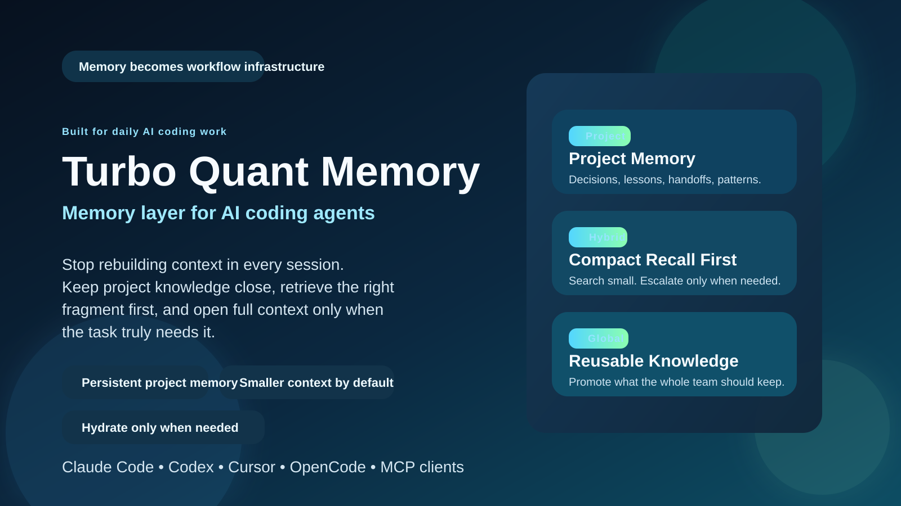

<!-- mcp-name: io.github.Lexus2016/turbo-quant-memory -->

<p align="center">
  
</p>

<h3 align="center">Local-first memory and knowledge graph for AI coding agents</h3>

<p align="center">
  Your agent stops re-reading files and re-deriving the same conclusions.<br>
  Your notes, code and secrets never leave your machine.
</p>

<p align="center">
  <a href="https://pypi.org/project/turbo-quant-memory/"></a>
  <a href="LICENSE"></a>
  <a href="https://registry.modelcontextprotocol.io/v0/servers?search=turbo-quant-memory"></a>
  
  <a href="https://github.com/Lexus2016/turbo_quant_memory/actions/workflows/ci.yml"></a>
  
  
</p>

---

## The problem

A long session accumulates hard-won detail about why the code is the way it is. Then the context compacts and it is gone. Next session the agent re-reads the same files, re-derives the same conclusions, and bills you for the same tokens again.

`CLAUDE.md` does not scale past a few dozen lines, and it cannot answer *"what did we decide about X, and why?"*.

**Turbo Quant Memory** is an MCP server that gives the agent a persistent, searchable store it writes to while it works — decisions, lessons, patterns, session handoffs — plus a compact index of your Markdown. Retrieval returns ~220-character result cards rather than whole documents; the agent loads full content only when a card is not enough.

## Why this one

|                          | **Turbo Quant Memory**                | mem0 / OpenMemory        | MCP `memory` server |
| :----------------------- | :------------------------------------ | :----------------------- | :------------------ |
| Where your data lives    | your disk, always                     | vendor cloud or self-host | your disk          |
| Your data leaves the host | **never**                            | yes, unless self-hosted  | never               |
| Retrieval                | hybrid BM25 + dense vector, RRF-fused | dense vector             | exact graph lookup  |
| What a search returns    | compact cards, hydrate on demand      | full memories            | full nodes          |
| Knowledge graph          | yes — with lifecycle + linting        | no                       | yes                 |
| Non-English content      | Cyrillic exact-match out of the box   | varies                   | n/a                 |
| Measures its own savings | **yes — `server_info()`**             | no                       | no                  |
| Price                    | free, MIT                             | paid tiers               | free                |

No HTTP client, no telemetry, no phone-home. Verify it yourself — this returns nothing:

```bash
grep -rnE '^[[:space:]]*(import|from)[[:space:]]+(requests|httpx|aiohttp|urllib3)\b' src/
```

To be precise about the one exception: on first run `fastembed` downloads the embedding model (~0.22 GB) from Hugging Face. After that the server runs fully offline. Your notes, code and secrets are never transmitted anywhere — there is nothing in the package that could send them.

## Install

### Let your agent install it

Paste this into Claude Code, Codex, Gemini CLI, Cursor or Antigravity:

> Install and configure the Turbo Quant Memory MCP server for this workspace from
> https://github.com/Lexus2016/turbo_quant_memory — follow the README, register the
> `tqmemory` server, run `turbo-memory-mcp skill install`, run the health check, and
> index this project.

`skill install` copies an operating manual into every agent skill directory on the machine, so every future session already knows how to use the memory without being told.

### Or install it yourself

```bash
uv tool install turbo-quant-memory
```

Then register the server with your client:

```bash
claude mcp add --scope project tqmemory -- turbo-memory-mcp serve   # Claude Code
codex  mcp add tqmemory -- turbo-memory-mcp serve                   # Codex
gemini mcp add tqmemory turbo-memory-mcp serve                      # Gemini CLI
```

Cursor, OpenCode, Antigravity and other clients → [CLIENT_INTEGRATIONS.md](CLIENT_INTEGRATIONS.md).
Hermes runs MCP through a systemd gateway → [docs/hermes.md](docs/hermes.md).

<!-- TQ-STATS:BEGIN (auto-generated by scripts/refresh_readme_stats.py — do not edit by hand) -->
### 📈 It measures its own savings — see for yourself

Turbo Quant Memory doesn't just *claim* to save tokens — every install keeps a running tally you can read anytime with `server_info()` (field `usage_stats.headline`). The savings are yours to verify, not ours to promise.

**Live snapshot from a real developer instance (v0.28.0):**

| What the memory did | Number |
| :--- | :--- |
| 🔢 Input tokens saved (cumulative) | **≈ 2,640,000** and counting |
| 🔁 Retrievals served | **2,275** searches + **280** deep hydrations |
| 📉 Average saved per retrieval | **≈ 1,200 tokens** |
| 📚 Knowledge under management | **234** active notes + **763** indexed code blocks |
| 🛡️ Integrity | **0** corrupted records · **0** pending migrations |

> These are one machine's cumulative numbers, not a synthetic benchmark — your own counter starts at zero and grows as your agent works. Run `server_info()` on your install to see your real figure.
<!-- TQ-STATS:END -->

## What it does

* **Typed notes.** `decision`, `lesson`, `pattern`, `handoff` — each stored with tags, provenance and a knowledge-graph link to the file or issue it is about.
* **Tiered memory.** `durable` (decisions, patterns) and `reference` (indexed docs) are searched by default; `episodic` (session handoffs) stays out of the way until you ask for it, so yesterday's noise never buries an architectural decision.
* **Hybrid retrieval.** A dense vector lane leads; a BM25 lane rescues exact terms — function names, file paths, IDs — fused with Reciprocal Rank Fusion. Cyrillic and other non-English terms match exactly, case- and accent-insensitive, with no configuration.
* **Knowledge graph.** Directed, timestamped relations between notes, files and issues. Search results carry the linked context inline, so the agent does not need a second lookup.
* **Human notes outrank agent notes.** Anything you explicitly asked to remember is flagged `human-explicit` and ranks above the agent's own observations at equal relevance.
* **Encrypted secrets vault.** Project-scoped, AES-256-GCM, structurally unreachable from search. → [docs/secrets-vault.md](docs/secrets-vault.md)
* **Runs on a small machine.** The default embedder is ONNX via fastembed — no PyTorch, ~0.22 GB model, comfortable on 2 GB of RAM.

Full technical detail → [docs/features.md](docs/features.md)

## The 19 MCP tools

| Group | Tools |
| :--- | :--- |
| Write | `remember_note` · `deprecate_note` · `promote_note` · `index_paths` |
| Read | `semantic_search` · `hydrate` · `recent_context` · `list_scopes` |
| Graph | `link_entities` · `unlink_entities` · `get_related_entities` |
| Hygiene | `lint_knowledge_base` · `health` · `self_test` · `server_info` |
| Vault | `set_secret` · `get_secret` · `list_secrets` · `delete_secret` |

## Documentation

| | |
| :--- | :--- |
| [MEMORY_STRATEGY.md](MEMORY_STRATEGY.md) | How to actually use the memory day to day |
| [CLIENT_INTEGRATIONS.md](CLIENT_INTEGRATIONS.md) | Per-client setup: Cursor, OpenCode, Antigravity, … |
| [TECHNICAL_SPEC.md](TECHNICAL_SPEC.md) | Architecture and storage format |
| [docs/features.md](docs/features.md) | Retrieval, graph, tiers, embedder, FTS language |
| [docs/secrets-vault.md](docs/secrets-vault.md) | Vault setup, threat model, FAQ |
| [docs/hermes.md](docs/hermes.md) | Hermes gateway setup and troubleshooting |
| [CHANGELOG.md](CHANGELOG.md) | Release history |

## License

[MIT](LICENSE). Copy it, modify it, fork it, ship it inside a closed-source product, sell it. Attribution is the only condition.

## Languages

🇺🇸 [English](README.md) · 🇺🇦 [Українська](README.uk.md) · 🇷🇺 [Русский](README.ru.md)
