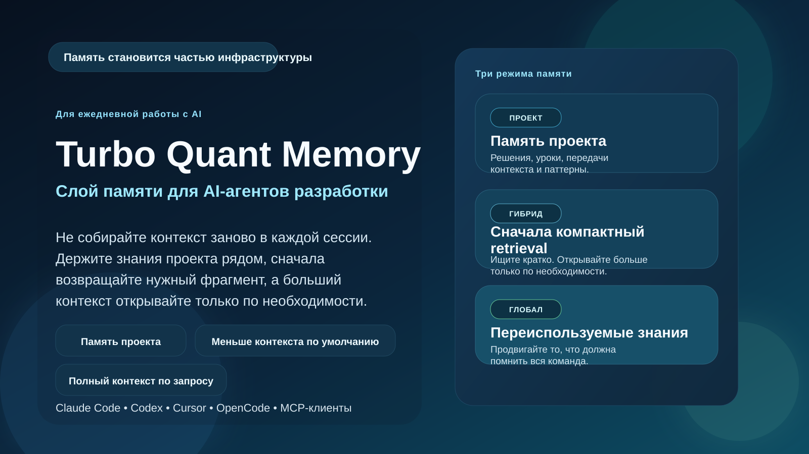

<p align="center">
  
</p>

<h3 align="center">Локальная память и граф знаний для ИИ-агентов разработки</h3>

<p align="center">
  Агент перестаёт перечитывать одни и те же файлы и заново выводить одни и те же выводы.<br>
  Ваши заметки, код и секреты никогда не покидают вашу машину.
</p>

<p align="center">
  <a href="LICENSE"></a>
  
  <a href="https://github.com/Lexus2016/turbo_quant_memory/actions/workflows/ci.yml"></a>
  
  
</p>

---

## Проблема

За долгую сессию накапливается выстраданное понимание того, почему код именно такой. Затем контекст сжимается — и это исчезает. В следующей сессии агент перечитывает те же файлы, заново выводит те же выводы и выставляет вам счёт за те же токены.

`CLAUDE.md` не масштабируется дальше нескольких десятков строк и не умеет отвечать на вопрос *«что мы решили насчёт X и почему?»*.

**Turbo Quant Memory** — это MCP-сервер, который даёт агенту постоянное хранилище с поиском, куда тот пишет по ходу работы: решения, уроки, паттерны, передачи между сессиями, плюс компактный индекс вашего Markdown. Поиск возвращает карточки результатов примерно на 220 символов вместо целых документов; полное содержимое агент подгружает только тогда, когда карточки недостаточно.

## Почему именно этот

|                              | **Turbo Quant Memory**                     | mem0 / OpenMemory          | MCP-сервер `memory` |
| :--------------------------- | :----------------------------------------- | :------------------------- | :------------------ |
| Где лежат данные             | всегда на вашем диске                       | облако вендора или самохост | на вашем диске     |
| Данные покидают машину       | **никогда**                                 | да, если не самохост       | никогда             |
| Поиск                        | гибридный BM25 + вектор, слияние через RRF  | плотный вектор             | точный обход графа  |
| Что возвращает запрос        | компактные карточки, подгрузка по запросу   | полные воспоминания        | полные узлы         |
| Граф знаний                  | да — с жизненным циклом и линтингом          | нет                        | да                  |
| Неанглийское содержимое      | кириллица совпадает точно «из коробки»       | по-разному                 | —                   |
| Считает собственную экономию | **да — `server_info()`**                    | нет                        | нет                 |
| Цена                         | бесплатно, MIT                              | платные тарифы             | бесплатно           |

Никакого HTTP-клиента, никакой телеметрии, никаких «звонков домой». Проверьте сами — команда ничего не вернёт:

```bash
grep -rnE '^[[:space:]]*(import|from)[[:space:]]+(requests|httpx|aiohttp|urllib3)\b' src/
```

Ради точности, одно исключение: при первом запуске `fastembed` скачивает модель эмбеддингов (~0,22 ГБ) с Hugging Face. После этого сервер работает полностью офлайн. Ваши заметки, код и секреты не передаются никуда — в пакете просто нет кода, способного их отправить.

## Установка

### Поручите установку агенту

Вставьте это в Claude Code, Codex, Gemini CLI, Cursor или Antigravity:

> Установи и настрой MCP-сервер Turbo Quant Memory для этого рабочего пространства из
> https://github.com/Lexus2016/turbo_quant_memory — действуй по README, зарегистрируй
> сервер `tqmemory`, выполни `turbo-memory-mcp skill install`, проведи проверку
> работоспособности и проиндексируй этот проект.

`skill install` копирует инструкцию по эксплуатации во все каталоги навыков агентов на машине, так что каждая следующая сессия уже знает, как пользоваться памятью, без отдельных объяснений.

### Или установите вручную

```bash
uv tool install turbo-quant-memory
```

Затем зарегистрируйте сервер в своём клиенте:

```bash
claude mcp add --scope project tqmemory -- turbo-memory-mcp serve   # Claude Code
codex  mcp add tqmemory -- turbo-memory-mcp serve                   # Codex
gemini mcp add tqmemory turbo-memory-mcp serve                      # Gemini CLI
```

Cursor, OpenCode, Antigravity и другие клиенты → [CLIENT_INTEGRATIONS.ru.md](CLIENT_INTEGRATIONS.ru.md).
Hermes запускает MCP через systemd-шлюз → [docs/hermes.ru.md](docs/hermes.ru.md).

<!-- TQ-STATS:BEGIN (auto-generated by scripts/refresh_readme_stats.py — do not edit by hand) -->
### 📈 Память сама считает свою экономию — убедитесь лично

Turbo Quant Memory не просто *обещает* экономить токены — каждая установка ведёт живой подсчёт, который вы в любой момент прочитаете через `server_info()` (поле `usage_stats.headline`). Эту экономию вы проверяете сами, а не верите нам на слово.

**Живой срез с реального инстанса разработчика (v0.28.0):**

| Что сделала память | Число |
| :--- | :--- |
| 🔢 Сэкономлено входных токенов (суммарно) | **≈ 2 640 000** и растёт |
| 🔁 Обработано запросов | **2 275** поисков + **280** глубоких подгрузок |
| 📉 Средняя экономия на запрос | **≈ 1 200 токенов** |
| 📚 Знаний под управлением | **234** активных заметок + **763** проиндексированных блоков кода |
| 🛡️ Целостность | **0** повреждённых записей · **0** незавершённых миграций |

> Это суммарные числа одной машины, а не синтетический бенчмарк — ваш собственный счётчик стартует с нуля и растёт по мере работы агента. Запустите `server_info()` на своей установке, чтобы увидеть свою реальную цифру.
<!-- TQ-STATS:END -->

## Что он делает

* **Типизированные заметки.** `decision`, `lesson`, `pattern`, `handoff` — каждая хранится с тегами, происхождением и связью в графе знаний с файлом или задачей, которой касается.
* **Уровни памяти.** `durable` (решения, паттерны) и `reference` (проиндексированные документы) ищутся по умолчанию; `episodic` (передачи между сессиями) не мешает, пока вы его не запросите, так что вчерашний шум никогда не хоронит архитектурное решение.
* **Гибридный поиск.** Ведёт плотный векторный канал; канал BM25 спасает точные термины — имена функций, пути к файлам, идентификаторы — и сливается через Reciprocal Rank Fusion. Кириллица и другие неанглийские термины совпадают точно, без учёта регистра и диакритики, без каких-либо настроек.
* **Граф знаний.** Направленные связи с метками времени между заметками, файлами и задачами. Результаты поиска несут связанный контекст внутри, так что агенту не нужен второй запрос.
* **Заметки человека весят больше заметок агента.** Всё, что вы явно попросили запомнить, помечается как `human-explicit` и при равной релевантности стоит выше собственных наблюдений агента.
* **Зашифрованное хранилище секретов.** Привязано к проекту, AES-256-GCM, структурно недостижимо для поиска. → [docs/secrets-vault.ru.md](docs/secrets-vault.ru.md)
* **Работает на слабой машине.** Эмбеддер по умолчанию — ONNX через fastembed: без PyTorch, модель ~0,22 ГБ, комфортно на 2 ГБ оперативной памяти.

Полные технические подробности → [docs/features.ru.md](docs/features.ru.md)

## 19 MCP-инструментов

| Группа | Инструменты |
| :--- | :--- |
| Запись | `remember_note` · `deprecate_note` · `promote_note` · `index_paths` |
| Чтение | `semantic_search` · `hydrate` · `recent_context` · `list_scopes` |
| Граф | `link_entities` · `unlink_entities` · `get_related_entities` |
| Гигиена | `lint_knowledge_base` · `health` · `self_test` · `server_info` |
| Хранилище | `set_secret` · `get_secret` · `list_secrets` · `delete_secret` |

## Документация

| | |
| :--- | :--- |
| [MEMORY_STRATEGY.ru.md](MEMORY_STRATEGY.ru.md) | Как реально пользоваться памятью каждый день |
| [CLIENT_INTEGRATIONS.ru.md](CLIENT_INTEGRATIONS.ru.md) | Настройка под клиентов: Cursor, OpenCode, Antigravity, … |
| [TECHNICAL_SPEC.ru.md](TECHNICAL_SPEC.ru.md) | Архитектура и формат хранения |
| [docs/features.ru.md](docs/features.ru.md) | Поиск, граф, уровни, эмбеддер, язык полнотекстового индекса |
| [docs/secrets-vault.ru.md](docs/secrets-vault.ru.md) | Настройка хранилища, модель угроз, FAQ |
| [docs/hermes.ru.md](docs/hermes.ru.md) | Настройка шлюза Hermes и решение проблем |
| [CHANGELOG.md](CHANGELOG.md) | История выпусков |

## Лицензия

[MIT](LICENSE). Копируйте, изменяйте, форкайте, встраивайте в закрытый продукт, продавайте. Единственное условие — сохранение упоминания об авторстве.

## Языковые версии

🇺🇸 [English](README.md) · 🇺🇦 [Українська](README.uk.md) · 🇷🇺 [Русский](README.ru.md)
