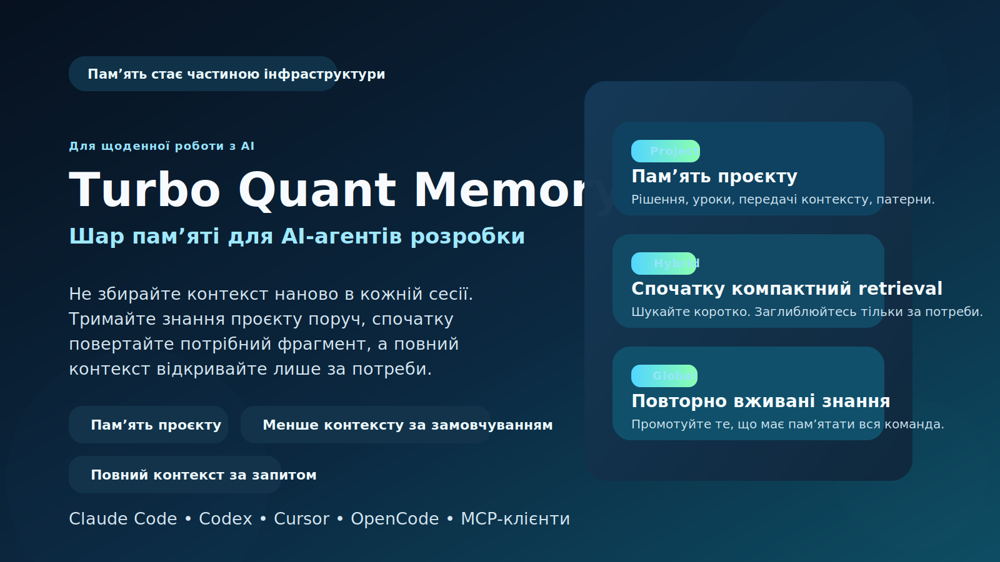

# Turbo Quant Memory for AI Agents



Інші мови: [English](README.md) | [Russian](README.ru.md)

AI-інструменти для розробки швидкі. Їхня пам’ять ні.

Turbo Quant Memory дає Claude Code, Codex, Cursor та іншим MCP-клієнтам стійкий шар пам’яті, щоб вони перестали знову і знову платити той самий податок на контекст.

Якщо ви працюєте з AI-агентами щодня, пам’ять перестає бути приємним бонусом і стає частиною базової інфраструктури.

## Чому це важливо

Без шару пам’яті команди постійно платять за одні й ті самі проблеми:

- агентам доводиться перечитувати забагато матеріалів, перш ніж вони почнуть діяти
- попередні рішення губляться між сесіями
- корисні висновки застрягають у старих чатах
- кожна нова задача знову починається зі збирання контексту з нуля

Turbo Quant Memory перетворює ці постійні втрати на повторно вживану інфраструктуру.

## Що ви отримуєте

- Менший контекст за замовчуванням: спочатку короткий результат пошуку, а повніший контекст лише за явним запитом
- Постійна пам’ять проєкту: рішення, уроки, передачі контексту та повторювані патерни
- Повторно вживані знання: перевірені нотатки можна промотити з проєкту в глобальний простір імен
- Локальний контроль: дані залишаються на вашій машині в `~/.turbo-quant-memory/`
- Прозорість для оператора: перевірки здоров’я, статистика сховища, статус свіжості й smoke-перевірка
- Підтримка кількох клієнтів: один MCP-сервер для Claude Code, Codex, Cursor, OpenCode та інших клієнтів

## Коротко про головне

Turbo Quant Memory допомагає AI-агентам пам’ятати важливе, за замовчуванням забирати менше контексту і переходити до повного контексту тільки тоді, коли задача справді цього потребує.

## Чому цим користуються далі

- Він зменшує повторне завантаження контексту.
- Він робить AI-сесії менш безпам’ятними.
- Він дає важливим знанням проєкту постійний дім поза історією чатів.
- Він робить retrieval керованим, а не перетворює кожну задачу на дамп цілих файлів.
- Він дає шар пам’яті, який можна перевірити, протестувати й контролювати.

## Доказ на цьому репозиторії

У репозиторії є реальні результати вимірювань у [benchmarks/latest.md](benchmarks/latest.md) та [benchmarks/latest.json](benchmarks/latest.json).

Поточний знімок вимірювань:

- Розмір корпусу: 9 Markdown-файлів, 138 індексованих блоків
- Повна індексація: 4.00 с
- Порожній incremental index: 0.68 с
- Середня затримка `semantic_search`: 75.14 мс
- Середня затримка `hydrate`: 41.71 мс
- Середня економія по байтах для `semantic_search` без hydrate: 78.02%
- Середня економія по байтах для `semantic_search + hydrate(top1)`: 63.41%
- Середня економія по словах для `semantic_search` без hydrate: 83.84%
- Середня економія по словах для `semantic_search + hydrate(top1)`: 74.76%

Що це означає на практиці:

- шлях за замовчуванням відчутно легший, ніж читання повних файлів
- навіть після `hydrate` по найкращому збігу guided-шлях усе одно лишається суттєво компактнішим за наївний сценарій
- більше контекстного бюджету лишається на міркування, а не на повторне читання тих самих матеріалів

Метод вимірювання:

- Базовий сценарій без керованої пам’яті: відкрити повний текст кожного унікального Markdown-файлу, який потрапив у top-5 результатів пошуку по проєкту
- Компактний шлях: використовувати тільки відповідь `semantic_search`
- Guided-шлях: використовувати `semantic_search`, а потім `hydrate` для найкращого Markdown-результату

Це реальні числа для цього репозиторію та цієї реалізації. Це не універсальна гарантія для будь-якої кодової бази.

## Встановлення

Рекомендоване встановлення релізної версії з GitHub-тега:

```bash
uv tool install git+https://github.com/Lexus2016/turbo_quant_memory@v0.2.1
turbo-memory-mcp serve
```

Резервний шлях через `pip`:

```bash
python -m pip install git+https://github.com/Lexus2016/turbo_quant_memory@v0.2.1
turbo-memory-mcp serve
```

Режим розробки з вихідного коду:

```bash
uv sync
uv run turbo-memory-mcp serve
```

Редагована `pip`-інсталяція з вихідного коду:

```bash
python -m venv .venv
. .venv/bin/activate
pip install -e .
python -m turbo_memory_mcp serve
```

## Підключення клієнта

Ідентифікатор сервера:

- `tqmemory`

Команда запуску:

- `turbo-memory-mcp serve`

Швидкі приклади:

- Claude Code: `claude mcp add --scope user tqmemory -- turbo-memory-mcp serve`
- Codex: `codex mcp add tqmemory -- turbo-memory-mcp serve`

Після встановлення MCP-сервера і підключення його до клієнта пам’ять стає частиною набору інструментів агента.

Не треба запускати окремі команди, відкривати друге вікно або вручну вмикати пам’ять для кожної задачі.

Далі ви просто спілкуєтесь з агентом звичайною мовою. Коли пам’ять доречна, агент може сам викликати `tqmemory`.

Якщо хочеться підкреслити це явно, можна написати "використай пам’ять проєкту" або згадати `tqmemory`, але це не обов’язково.

Готові конфіги:

- [examples/clients/claude.project.mcp.json](examples/clients/claude.project.mcp.json)
- [examples/clients/codex.config.toml](examples/clients/codex.config.toml)
- [examples/clients/cursor.project.mcp.json](examples/clients/cursor.project.mcp.json)
- [examples/clients/opencode.config.json](examples/clients/opencode.config.json)
- [examples/clients/antigravity.mcp.json](examples/clients/antigravity.mcp.json)

Smoke-чекліст:

- [examples/clients/SMOKE_CHECKLIST.md](examples/clients/SMOKE_CHECKLIST.md)

## Що писати Codex

З MCP-сервером не потрібно розмовляти shell-командами.

Ви пишете звичайний текст у Codex, а Codex сам викликає потрібні інструменти пам’яті.

Головне: після підключення MCP не потрібна спеціальна фраза-активація для кожної задачі.

У звичайній роботі ви просто описуєте задачу. Якщо пам’ять корисна, Codex має використати її автоматично.

Хороші шаблони запитів:

1. Перший запуск у новому репозиторії

```text
Проіндексуй цей репозиторій і скажи, яка пам’ять тепер доступна для наступних задач.
```

2. Перед зміною коду

```text
Перш ніж щось змінювати, перевір пам’ять проєкту на попередні рішення щодо auth, sessions і retries, а потім коротко підсумуй головне.
```

3. Коли треба знайти правильне джерело перед зміною

```text
Знайди в проєкті flow payment webhook, розкрий найрелевантніший результат із пам’яті й поясни, як зараз влаштована реалізація.
```

4. Коли треба зберегти рішення

```text
Збережи рішення в пам’ять як нотатку з назвою "Webhook retry policy" і коротким описом підходу, про який ми щойно домовилися.
```

5. Коли знання має жити не тільки в цьому проєкті

```text
Якщо нотатка, яку ми щойно створили, корисна і для інших проєктів, промотни її в global memory.
```

6. Коли потрібен повний сценарій за один запит

```text
Знайди все важливе про caching у цьому репозиторії, розкрий найкращий результат і запропонуй зміну коду на основі цього контексту.
```

7. Коли хочеться сказати це явно, але все одно по-людськи

```text
Спочатку використай пам’ять проєкту. Знайди попередні рішення щодо caching і retries, а потім продовжуй зі зміною.
```

## Простий людський сценарій

- Один раз встановіть MCP-сервер і підключіть його до агента.
- Після цього працюйте з Codex як звично. Ви описуєте задачу, а пам’ять за потреби підключається автоматично у фоні.
- У новому репозиторії все одно корисно один раз попросити проіндексувати матеріали, щоб пам’ять мала що шукати.
- Перед ризикованими змінами можна попросити агента спочатку перевірити пам’ять проєкту.
- Після важливих рішень варто попросити агента зберегти їх, щоб наступні сесії не втратили цей контекст.
- За замовчуванням індексація проєкту пропускає історичні та low-signal каталоги на кшталт `.planning`, `.serena` і згенерованих benchmark-звітів, щоб активний пошук лишався сфокусованим на живих документах і нотатках.

Найпростіша ментальна модель така:

- `semantic_search` — знайти
- `hydrate` — розкрити
- `remember_note` — зберегти
- `promote_note` — використати пізніше в інших задачах
- `deprecate_note` — вивести застаріле знання з активного пошуку без втрати історії

## Коли знання застаріло

- Спочатку збережіть нове правильне знання як нову нотатку.
- Потім викличте `deprecate_note` для старої нотатки, якщо вона більше не повинна з’являтися в активному пошуку.
- Якщо для старої нотатки є пряма заміна, передайте id нової нотатки, і стара стане `superseded`, а не просто архівною.
- Так історія не губиться, але `semantic_search` більше не піднімає застарілу інструкцію як актуальну.

## Технічні деталі

Модель просторів імен:

- `project`: локальні для репозиторію нотатки поточної кодової бази
- `global`: повторно вживані нотатки, які явно промотовано з `project`
- `hybrid`: об’єднаний пошук по `project` і `global` із сильним пріоритетом `project`

Порядок визначення поточного проєкту:

1. Нормалізований URL `origin`
2. Hash кореневого шляху репозиторію, якщо remote відсутній
3. Явні overrides через `TQMEMORY_PROJECT_ROOT`, `TQMEMORY_PROJECT_ID` і `TQMEMORY_PROJECT_NAME`

Набір інструментів:

- `health`
- `server_info`
- `list_scopes`
- `self_test`
- `remember_note`
- `promote_note`
- `deprecate_note`
- `semantic_search`
- `hydrate`
- `index_paths`

Де лежать дані:

- `~/.turbo-quant-memory/`

Команди перевірки репозиторію:

```bash
uv run pytest -q
uv run python scripts/smoke_test.py
uv run python scripts/benchmark_context_savings.py
```

## Обмеження і чесні застереження

- Проєкт не заявляє прямого контролю над KV-cache hosted-моделей.
- Перший embedding-backed запуск може завантажити `sentence-transformers/all-MiniLM-L6-v2`, якщо локальний кеш холодний.
- Benchmark-звіт вимірює цей репозиторій і цю реалізацію, а не будь-який можливий сценарій використання.

## Карта репозиторію

- Контракт рантайму і вхід у сервер: [src/turbo_memory_mcp/server.py](src/turbo_memory_mcp/server.py)
- Логіка hydration: [src/turbo_memory_mcp/hydration.py](src/turbo_memory_mcp/hydration.py)
- Модель зберігання: [src/turbo_memory_mcp/store.py](src/turbo_memory_mcp/store.py)
- Скрипт benchmark: [scripts/benchmark_context_savings.py](scripts/benchmark_context_savings.py)
- Технічна специфікація: [TECHNICAL_SPEC.md](TECHNICAL_SPEC.md)
- Стратегія пам’яті: [MEMORY_STRATEGY.md](MEMORY_STRATEGY.md)
