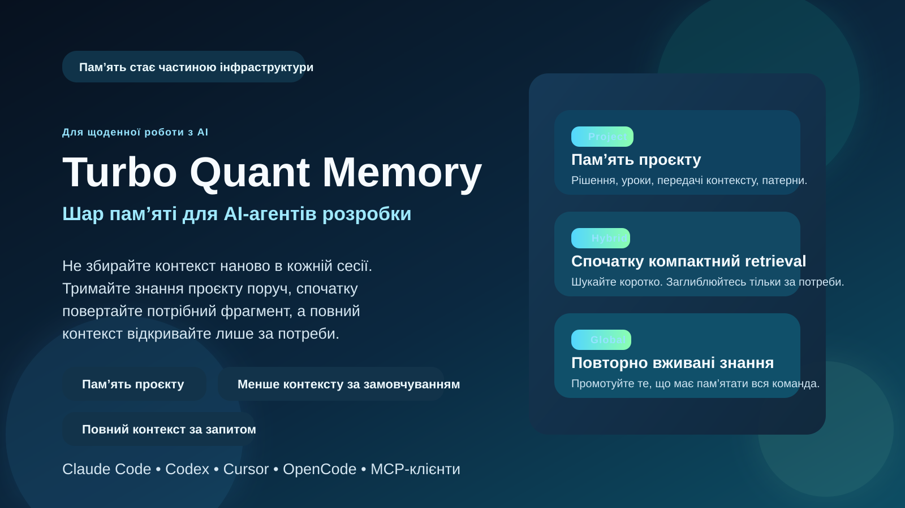

<p align="center">
  
</p>

<h3 align="center">Локальна пам'ять і граф знань для ШІ-агентів розробки</h3>

<p align="center">
  Агент перестає перечитувати ті самі файли й виводити ті самі висновки заново.<br>
  Ваші нотатки, код і секрети ніколи не залишають вашу машину.
</p>

<p align="center">
  <a href="https://pypi.org/project/turbo-quant-memory/"></a>
  <a href="LICENSE"></a>
  <a href="https://registry.modelcontextprotocol.io/v0/servers?search=turbo-quant-memory"></a>
  
  <a href="https://github.com/Lexus2016/turbo_quant_memory/actions/workflows/ci.yml"></a>
  
  
</p>

---

## Проблема

За довгу сесію накопичується вистраждане розуміння того, чому код саме такий. Далі контекст стискається — і це зникає. У наступній сесії агент перечитує ті самі файли, повторно виводить ті самі висновки й виставляє вам рахунок за ті самі токени.

`CLAUDE.md` не масштабується далі кількох десятків рядків і не вміє відповісти на питання *«що ми вирішили щодо X і чому?»*.

**Turbo Quant Memory** — це MCP-сервер, який дає агенту постійне сховище з пошуком, куди той пише під час роботи: рішення, уроки, патерни, передання між сесіями, а також компактний індекс вашого Markdown. Пошук повертає картки результатів приблизно на 220 символів замість цілих документів; повний вміст агент довантажує лише тоді, коли картки не вистачає.

## Чому саме цей

|                              | **Turbo Quant Memory**                     | mem0 / OpenMemory          | MCP-сервер `memory` |
| :--------------------------- | :----------------------------------------- | :------------------------- | :------------------ |
| Де лежать дані               | завжди на вашому диску                      | хмара вендора або самохост | на вашому диску     |
| Дані покидають машину        | **ніколи**                                  | так, якщо не самохост      | ніколи              |
| Пошук                        | гібридний BM25 + вектор, злиття через RRF   | щільний вектор             | точний обхід графа  |
| Що повертає запит            | компактні картки, довантаження за потреби   | повні спогади              | повні вузли         |
| Граф знань                   | так — з життєвим циклом і лінтингом          | ні                         | так                 |
| Неанглійський вміст          | кирилиця збігається точно «з коробки»        | по-різному                 | —                   |
| Рахує власну економію        | **так — `server_info()`**                   | ні                         | ні                  |
| Ціна                         | безкоштовно, MIT                            | платні тарифи              | безкоштовно         |

Жодного HTTP-клієнта, жодної телеметрії, жодних «дзвінків додому». Перевірте самі — команда нічого не поверне:

```bash
grep -rnE '^[[:space:]]*(import|from)[[:space:]]+(requests|httpx|aiohttp|urllib3)\b' src/
```

Точності заради, один виняток: при першому запуску `fastembed` завантажує модель ембедингів (~0,22 ГБ) з Hugging Face. Після цього сервер працює повністю офлайн. Ваші нотатки, код і секрети не передаються нікуди — у пакеті просто немає коду, здатного їх надіслати.

## Встановлення

### Доручіть встановлення агенту

Вставте це в Claude Code, Codex, Gemini CLI, Cursor або Antigravity:

> Встанови та налаштуй MCP-сервер Turbo Quant Memory для цього робочого простору з
> https://github.com/Lexus2016/turbo_quant_memory — дій за README, зареєструй сервер
> `tqmemory`, виконай `turbo-memory-mcp skill install`, проведи перевірку працездатності
> та проіндексуй цей проєкт.

`skill install` копіює інструкцію з експлуатації в усі каталоги навичок агентів на машині, тож кожна наступна сесія вже знає, як користуватися пам'яттю, без окремих пояснень.

### Або встановіть вручну

```bash
uv tool install turbo-quant-memory
```

Далі зареєструйте сервер у своєму клієнті:

```bash
claude mcp add --scope project tqmemory -- turbo-memory-mcp serve   # Claude Code
codex  mcp add tqmemory -- turbo-memory-mcp serve                   # Codex
gemini mcp add tqmemory turbo-memory-mcp serve                      # Gemini CLI
```

Cursor, OpenCode, Antigravity та інші клієнти → [CLIENT_INTEGRATIONS.uk.md](CLIENT_INTEGRATIONS.uk.md).
Hermes запускає MCP через systemd-шлюз → [docs/hermes.uk.md](docs/hermes.uk.md).

<!-- TQ-STATS:BEGIN (auto-generated by scripts/refresh_readme_stats.py — do not edit by hand) -->
### 📈 Пам'ять сама рахує свою економію — переконайтеся особисто

Turbo Quant Memory не просто *обіцяє* економити токени — кожна інсталяція веде живий підрахунок, який ви будь-коли зчитаєте через `server_info()` (поле `usage_stats.headline`). Цю економію ви перевіряєте самі, а не вірите нам на слово.

**Живий зріз з реального інстансу розробника (v0.28.0):**

| Що зробила пам'ять | Число |
| :--- | :--- |
| 🔢 Заощаджено вхідних токенів (сумарно) | **≈ 2 640 000** і зростає |
| 🔁 Оброблено запитів | **2 275** пошуків + **280** глибоких підвантажень |
| 📉 Середня економія на запит | **≈ 1 200 токенів** |
| 📚 Знань під керуванням | **234** активних нотаток + **763** проіндексованих блоків коду |
| 🛡️ Цілісність | **0** пошкоджених записів · **0** незавершених міграцій |

> Це сумарні числа однієї машини, а не синтетичний бенчмарк — ваш власний лічильник стартує з нуля й зростає в міру роботи агента. Запустіть `server_info()` на своїй інсталяції, щоб побачити свою реальну цифру.
<!-- TQ-STATS:END -->

## Що він робить

* **Типізовані нотатки.** `decision`, `lesson`, `pattern`, `handoff` — кожна зберігається з тегами, походженням і зв'язком у графі знань до файлу чи задачі, якої стосується.
* **Рівні пам'яті.** `durable` (рішення, патерни) і `reference` (проіндексовані документи) шукаються за замовчуванням; `episodic` (передання між сесіями) не заважає, доки ви його не попросите, тож учорашній шум ніколи не ховає архітектурне рішення.
* **Гібридний пошук.** Веде щільний векторний канал; канал BM25 рятує точні терміни — імена функцій, шляхи до файлів, ідентифікатори — і зливається через Reciprocal Rank Fusion. Кирилиця та інші неанглійські терміни збігаються точно, без урахування регістру й діакритики, без жодних налаштувань.
* **Граф знань.** Спрямовані зв'язки з мітками часу між нотатками, файлами та задачами. Результати пошуку несуть пов'язаний контекст усередині, тож агенту не потрібен другий запит.
* **Нотатки людини важать більше за нотатки агента.** Усе, що ви явно попросили запам'ятати, позначається як `human-explicit` і за однакової релевантності стоїть вище власних спостережень агента.
* **Зашифроване сховище секретів.** Прив'язане до проєкту, AES-256-GCM, структурно недосяжне для пошуку. → [docs/secrets-vault.uk.md](docs/secrets-vault.uk.md)
* **Працює на слабкій машині.** Ембедер за замовчуванням — ONNX через fastembed: без PyTorch, модель ~0,22 ГБ, комфортно на 2 ГБ оперативної пам'яті.

Повні технічні подробиці → [docs/features.uk.md](docs/features.uk.md)

## 19 MCP-інструментів

| Група | Інструменти |
| :--- | :--- |
| Запис | `remember_note` · `deprecate_note` · `promote_note` · `index_paths` |
| Читання | `semantic_search` · `hydrate` · `recent_context` · `list_scopes` |
| Граф | `link_entities` · `unlink_entities` · `get_related_entities` |
| Гігієна | `lint_knowledge_base` · `health` · `self_test` · `server_info` |
| Сховище | `set_secret` · `get_secret` · `list_secrets` · `delete_secret` |

## Документація

| | |
| :--- | :--- |
| [MEMORY_STRATEGY.uk.md](MEMORY_STRATEGY.uk.md) | Як реально користуватися пам'яттю щодня |
| [CLIENT_INTEGRATIONS.uk.md](CLIENT_INTEGRATIONS.uk.md) | Налаштування під клієнтів: Cursor, OpenCode, Antigravity, … |
| [TECHNICAL_SPEC.uk.md](TECHNICAL_SPEC.uk.md) | Архітектура та формат зберігання |
| [docs/features.uk.md](docs/features.uk.md) | Пошук, граф, рівні, ембедер, мова повнотекстового індексу |
| [docs/secrets-vault.uk.md](docs/secrets-vault.uk.md) | Налаштування сховища, модель загроз, FAQ |
| [docs/hermes.uk.md](docs/hermes.uk.md) | Налаштування шлюзу Hermes і розв'язання проблем |
| [CHANGELOG.md](CHANGELOG.md) | Історія випусків |

## Ліцензія

[MIT](LICENSE). Копіюйте, змінюйте, форкайте, вбудовуйте в закритий продукт, продавайте. Єдина умова — збереження згадки про авторство.

## Мовні версії

🇺🇸 [English](README.md) · 🇺🇦 [Українська](README.uk.md) · 🇷🇺 [Русский](README.ru.md)
