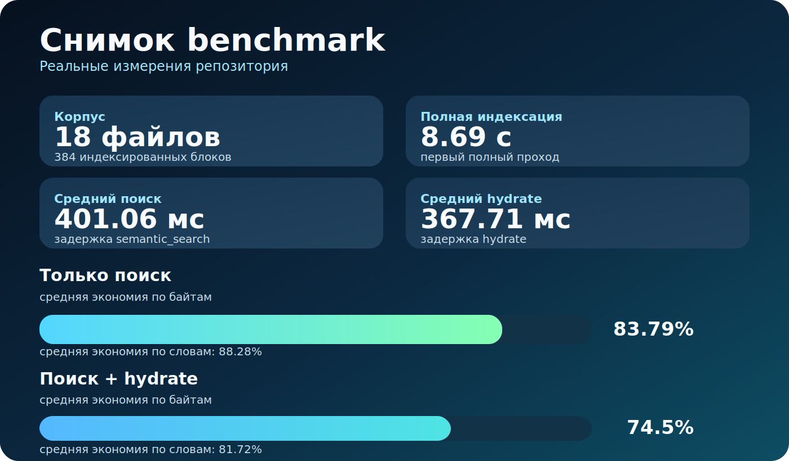

# Результаты Бенчмарка

- Сгенерировано: `2026-03-28T17:20:15.198620+00:00`
- Корпус: `17` Markdown-файлов, `247` индексированных блоков
- Полная индексация: `5553.57` ms
- Пустой incremental: `844.25` ms

## Коротко По Сути

| Метрика | Результат | Что это означает |
|---|---:|---|
| Корпус | 17 файлов · 247 блоков | Это измерение на реальном корпусе этого репозитория |
| Полная индексация | 5.55 с | Первичная индексация остаётся короткой |
| Пустой incremental | 0.84 с | Переиндексация после малых изменений остаётся лёгкой |
| Средний `semantic_search` | 68.13 мс | Этого достаточно для стандартного retrieval-пути |
| Средний `hydrate` | 41.63 мс | Открывать больше контекста всё ещё дёшево |
| Экономия байтов, только поиск | 63.96% | В модель передаётся заметно меньше текста |
| Экономия байтов, поиск + hydrate | 44.1% | Даже управляемый путь заметно меньше открытия полных файлов |

## Что Означают Эти Результаты

- Компактный retrieval-путь намного меньше наивного открытия полных файлов.
- Даже после hydration лучшего hit-а управляемый путь всё равно хорошо экономит контекст.
- Больше контекстного бюджета остаётся на рассуждение, а не на повторное чтение.

## Суммарная Экономия

| Стратегия | Средняя экономия байтов | Медианная экономия байтов | Средняя экономия слов |
|---|---:|---:|---:|
| `semantic_search` only | 63.96% | 65.1% | 75.02% |
| `semantic_search` + `hydrate(top1)` | 44.1% | 45.67% | 63.51% |

## Разбор По Запросам

| Запрос | Топовый hit | Байты полных файлов | Байты поиска | Байты поиск+hydrate | Экономия поиска | Экономия управляемого пути |
|---|---|---:|---:|---:|---:|---:|
| `namespace model project global hybrid` | ``hybrid`` | 9151 | 5486 | 8409 | 40.05% | 8.11% |
| `hydrate bounded neighborhood related mode` | `Hydration Strategy` | 22069 | 5963 | 8845 | 72.98% | 59.92% |
| `current project resolution git remote overrides` | `Project Identity` | 17837 | 6102 | 9114 | 65.79% | 48.9% |
| `storage stats freshness index status` | `Acceptance Criteria` | 15996 | 5913 | 9206 | 63.03% | 42.45% |
| `Claude Code Codex Cursor OpenCode integrations` | `OpenCode` | 18582 | 6613 | 10905 | 64.41% | 41.31% |
| `remember note decision lesson handoff pattern` | `Memory note` | 25147 | 5659 | 9072 | 77.5% | 63.92% |

## Метод

| Стратегия | Что это означает |
|---|---|
| Базовый сценарий без MCP | Открыть полный текст каждого уникального Markdown-файла, который представлен в топ-5 project search hit-ах |
| Компактный MCP-путь | Использовать только ответ `semantic_search` |
| Управляемый MCP-путь | Использовать `semantic_search`, а затем `hydrate` только для топового Markdown hit-а |

Экономия считается относительно базового сценария по реальным UTF-8 byte count и word count из этого репозитория.
