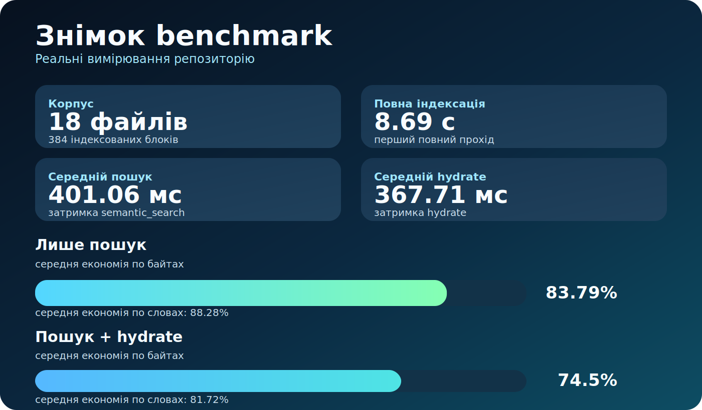

# Результати Бенчмарку

- Згенеровано: `2026-03-28T17:20:15.198620+00:00`
- Корпус: `17` Markdown-файлів, `247` індексованих блоків
- Повна індексація: `5553.57` ms
- Порожній incremental: `844.25` ms

## Коротко По Суті

| Метрика | Результат | Що це означає |
|---|---:|---|
| Корпус | 17 файлів · 247 блоків | Це вимірювання на реальному корпусі цього репозиторію |
| Повна індексація | 5.55 с | Перша індексація лишається короткою |
| Порожній incremental | 0.84 с | Переіндексація після малих змін лишається легкою |
| Середній `semantic_search` | 68.13 мс | Цього достатньо для дефолтного retrieval-шляху |
| Середній `hydrate` | 41.63 мс | Відкривати більше контексту все ще дешево |
| Економія байтів, лише пошук | 63.96% | До моделі передається значно менше тексту |
| Економія байтів, пошук + hydrate | 44.1% | Навіть керований шлях помітно менший за відкриття повних файлів |

## Що Означають Ці Результати

- Компактний retrieval-потік набагато менший за наївне відкриття повних файлів.
- Навіть після hydration найкращого hit-а керований шлях усе одно добре економить контекст.
- Більше контекстного бюджету лишається на міркування, а не на повторне читання.

## Сумарна Економія

| Стратегія | Середня економія байтів | Медіанна економія байтів | Середня економія слів |
|---|---:|---:|---:|
| `semantic_search` only | 63.96% | 65.1% | 75.02% |
| `semantic_search` + `hydrate(top1)` | 44.1% | 45.67% | 63.51% |

## Розбір По Запитах

| Запит | Топовий hit | Байти повних файлів | Байти пошуку | Байти пошук+hydrate | Економія пошуку | Економія керованого шляху |
|---|---|---:|---:|---:|---:|---:|
| `namespace model project global hybrid` | ``hybrid`` | 9151 | 5486 | 8409 | 40.05% | 8.11% |
| `hydrate bounded neighborhood related mode` | `Hydration Strategy` | 22069 | 5963 | 8845 | 72.98% | 59.92% |
| `current project resolution git remote overrides` | `Project Identity` | 17837 | 6102 | 9114 | 65.79% | 48.9% |
| `storage stats freshness index status` | `Acceptance Criteria` | 15996 | 5913 | 9206 | 63.03% | 42.45% |
| `Claude Code Codex Cursor OpenCode integrations` | `OpenCode` | 18582 | 6613 | 10905 | 64.41% | 41.31% |
| `remember note decision lesson handoff pattern` | `Memory note` | 25147 | 5659 | 9072 | 77.5% | 63.92% |

## Метод

| Стратегія | Що це означає |
|---|---|
| Базовий сценарій без MCP | Відкрити повний текст кожного унікального Markdown-файлу, який представлений у топ-5 project search hit-ах |
| Компактний MCP-шлях | Використати тільки відповідь `semantic_search` |
| Керований MCP-шлях | Використати `semantic_search`, а потім `hydrate` тільки для топового Markdown hit-а |

Економія рахується відносно базового сценарію за реальними UTF-8 byte count і word count з цього репозиторію.
