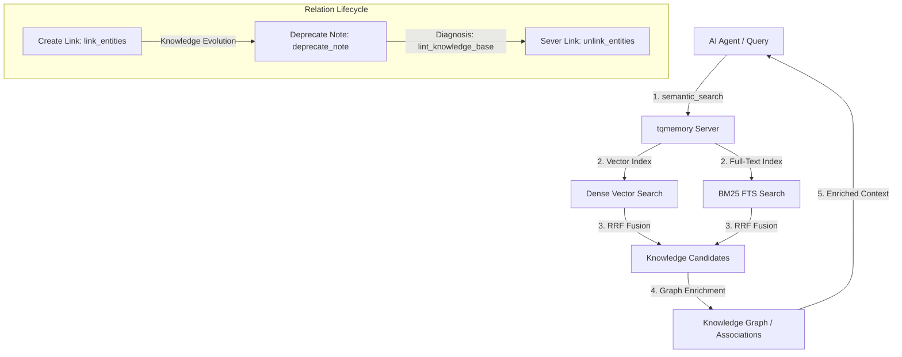

# 🌟 Advanced Features (Under the Hood)

### 1. Hybrid BM25 + Vector Search (vector-first gated)
Every query searches a dense-vector space (semantic meaning) and a BM25 full-text index (exact terms like function names, file paths, or IDs). The dense lane leads: when its top hit is confident, it is returned directly; otherwise the BM25 lane is fused in via Reciprocal Rank Fusion (RRF, `k=60`) as a **down-weighted rescue**. This vector-first gating measurably beat plain equal-weight RRF on real multilingual corpora (it stops a noisy keyword lane from dragging a confident semantic hit down). If a lane fails, search degrades gracefully to vector-only.

### 2. Knowledge Graph Relations
You can build associations between notes, source files, issues, or tasks using directed relations. The memory server automatically enriches search and hydration results with these relations, letting AI agents browse associated context effortlessly.

#### 🔄 Dynamic Relation Lifecycle (Core Strength):
* **Provenance & timestamps:** Relations are directed and carry a `created_at` timestamp. Deprecating a note flips that note's own status but does **not** cascade to its relations, so an agent should check an endpoint's status when following a link.
* **Flexible Decoupling (Unlinking):** Any relation can be easily severed using the `unlink_entities()` tool. This gives the agent memory absolute flexibility to adapt to refactorings and design changes.
* **Knowledge-base linting:** `lint_knowledge_base()` checks the Markdown knowledge base — broken links, orphaned docs, duplicate titles, stale episodic notes, and near-duplicate notes. It does not currently inspect graph relations.

#### 📊 Visual Memory Architecture:


### 3. Tiered Memory Architecture
Memory notes are separated into logical tiers:
* `durable`: Decisions, architectural patterns, lessons.
* `episodic`: Session handoffs, daily progress.
* `reference`: Markdown blocks, file references.

Default searches return only `durable` + `reference` so session noise never drowns out critical architectural decisions!

### 4. Lightweight ONNX embedder (default)
The embedder runs the multilingual model through **ONNX Runtime (fastembed) by default** — no PyTorch in the client install (hundreds of MB saved on macOS, up to multi-GB with CUDA wheels on Linux), a smaller resident footprint (the model itself is ~0.22 GB in ONNX vs ~1 GB+ under PyTorch), and it fits comfortably on a ~2 GB RAM machine. Retrieval quality is identical to the legacy PyTorch backend and the embeddings are vector-compatible, so upgrading needs **no reindex**.

The legacy PyTorch backend remains available for rollback or A/B checks:

```bash
uv tool install --force 'turbo-quant-memory[torch]'
export TQMEMORY_EMBEDDING_BACKEND=sentence-transformers   # default: fastembed
```

### 5. User-Flagged Memory (provenance)
Every note records **who created it**: `human-explicit` when you explicitly ask the agent to remember something ("remember this", "save this to my knowledge base"), or `agent` when the agent saves a lesson/decision on its own. Human-flagged notes are trusted more — they **rank above agent-written notes of equal relevance** (a deterministic tie-breaker plus a small score bonus). The field is optional and backward compatible: existing notes simply read as `agent`, so no migration is needed.

### 6. Full-text search language (multilingual, opt-in)
The BM25 full-text lane tokenizes on Unicode word boundaries with lower-casing and accent folding, so **Ukrainian, Russian and other non-English *exact* terms already match** (case- and accent-insensitive) out of the box — Cyrillic is never mangled. What one index cannot do is stem more than one language at once. The default stems **English**; a Cyrillic-dominant deployment can switch the stemmer:

```bash
export TQMEMORY_FTS_LANGUAGE=Russian   # default: English
```

Russian stemming additionally matches *inflected* Cyrillic forms (`документ` ↔ `документами`, plus many shared Ukrainian suffixes) — at the cost of English stemming, since LanceDB applies one stemmer per index. Ukrainian has no dedicated Snowball stemmer, so Russian is the closest option; an unsupported value safely falls back to English with a warning. The change takes effect after the FTS index is rebuilt (a retrieval reset + reindex), like switching the embedding model — and inflected matching is in any case already covered semantically by the dense vector lane.
