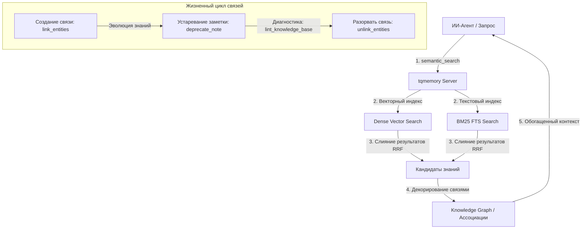

# 🌟 Продвинутые функции (Под капотом)

### 1. Гибридный поиск (BM25 + Dense Vector)
Каждый запрос ищет в векторном пространстве (семантический смысл) и в текстовом индексе BM25 FTS (точные совпадения: имена функций, пути, идентификаторы). Ведущий — векторный канал: если его лучшее совпадение уверенное, оно возвращается напрямую; иначе канал BM25 добавляется через Reciprocal Rank Fusion (RRF, `k=60`) как **сниженный по весу спасательный**. Это vector-first гейтирование измеримо превзошло равновесный RRF на реальных многоязычных корпусах (шумный текстовый канал больше не тянет уверенное семантическое совпадение вниз). Если канал даёт сбой, поиск мягко переходит на только-векторный.

### 2. Графовые связи знаний (Knowledge Graph Relations)
Вы можете создавать связи между заметками, файлами, задачами или багами с помощью направленных связей. Сервер памяти автоматически обогащает результаты поиска и гидрации этими связями, позволяя ИИ легко ориентироваться в ассоциативном контексте кода.

#### 🔄 Динамический жизненный цикл связей (Сильная сторона):
* **Происхождение и метки времени:** Связи направленные и имеют метку `created_at`. Пометка заметки как устаревшей меняет статус самой заметки, но **не** каскадируется на её связи — поэтому при переходе по связи агенту стоит проверять статус конечной сущности.
* **Гибкое управление (Разрыв связей):** Любую связь можно легко удалить или разорвать с помощью инструмента `unlink_entities()`. Это позволяет гибко адаптировать память к изменениям в архитектуре.
* **Линтинг базы знаний:** `lint_knowledge_base()` проверяет Markdown-базу знаний — битые ссылки, осиротевшие документы, дублирующиеся заголовки, устаревшие эпизодические заметки и почти-дубликаты. Связи графа он пока не анализирует.

#### 📊 Визуальная схема работы памяти:


### 3. Многоуровневая архитектура памяти
Заметки разделены на логические уровни (tiers):
* `durable` (долговечная): решения, архитектурные шаблоны, уроки.
* `episodic` (эпизодическая): передача контекста сессий, ежедневный прогресс.
* `reference` (справочная): Markdown-блоки, ссылки на файлы.

Поиск по умолчанию возвращает только уровни `durable` + `reference`, чтобы эпизодический шум сессий не мешал важным архитектурным решениям!

### 4. Лёгкий ONNX-эмбеддер (по умолчанию)
Эмбеддер запускает многоязычную модель через **ONNX Runtime (fastembed) по умолчанию** — PyTorch больше не попадает в клиентскую установку (от сотен МБ на macOS до нескольких ГБ CUDA-колёс на Linux), процесс занимает меньше памяти (сама модель ~0.22 ГБ в ONNX против ~1 ГБ+ под PyTorch), и сервер комфортно помещается на машине с ~2 ГБ RAM. Качество поиска идентично старому PyTorch-бэкенду, векторы совместимы — обновление **не требует переиндексации**.

Старый PyTorch-бэкенд доступен для отката или A/B-проверок:

```bash
pip install 'turbo-memory-mcp[torch]'
export TQMEMORY_EMBEDDING_BACKEND=sentence-transformers   # по умолчанию: fastembed
```

### 5. Память, помеченная пользователем (provenance)
Каждая заметка фиксирует, **кто её создал**: `human-explicit`, когда ты прямо просишь агента что-то запомнить («запомни это», «сохрани в базу знаний»), или `agent`, когда агент сам сохраняет урок или решение. Помеченным человеком заметкам больше доверия — они **ранжируются выше созданных агентом при равной релевантности** (детерминированный tie-breaker плюс небольшой бонус к оценке). Поле опциональное и обратно-совместимое: существующие заметки просто читаются как `agent`, так что миграция не нужна.

### 6. Язык полнотекстового поиска (многоязычность, опционально)
Полнотекстовая линия BM25 разбивает текст по границам слов Unicode, с приведением к нижнему регистру и сворачиванием диакритики, так что **украинские, русские и другие не-английские *точные* слова уже находятся** (независимо от регистра и диакритики) — кириллица никогда не портится. Чего один индекс не умеет — это стеммить несколько языков одновременно. По умолчанию стеммится **английский**; для кириллично-доминантной установки стеммер можно переключить:

```bash
export TQMEMORY_FTS_LANGUAGE=Russian   # по умолчанию: English
```

Русский стемминг дополнительно находит *словоформы* кириллицы (`документ` ↔ `документами`, а также многие общие украинские суффиксы) — ценой английского стемминга, поскольку LanceDB применяет один стеммер на индекс. Отдельного стеммера Snowball для украинского нет, поэтому Russian — ближайший вариант; неподдерживаемое значение безопасно откатывается на English с предупреждением. Изменение вступает в силу после перестройки FTS-индекса (сброс + переиндексация), как и смена модели векторных представлений — а словоформы в любом случае уже покрывает семантически плотная векторная линия.
