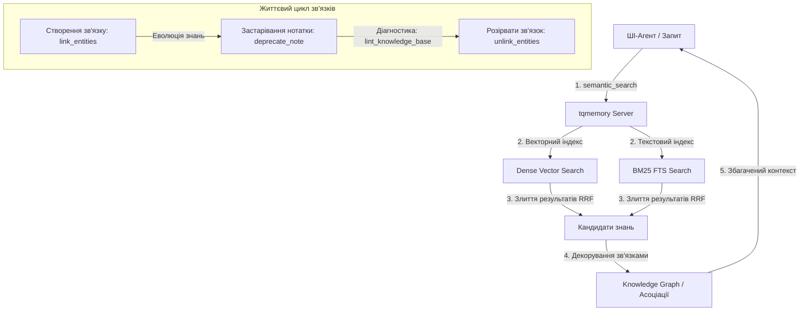

# 🌟 Просунуті функції (Під капотом)

### 1. Гібридний пошук (BM25 + Dense Vector)
Кожен запит шукає у векторному просторі (семантичний зміст) і в текстовому індексі BM25 FTS (точні збіги: імена функцій, шляхи, ідентифікатори). Провідним є векторний канал: якщо його найкращий збіг впевнений — він повертається напряму; інакше канал BM25 додається через Reciprocal Rank Fusion (RRF, `k=60`) як **знижений за вагою рятувальний**. Це vector-first гейтування виміряно перевершило рівне RRF на реальних багатомовних корпусах (шумний текстовий канал більше не тягне впевнений семантичний збіг донизу). Якщо канал дає збій, пошук м'яко переходить на лише-векторний.

### 2. Графові зв'язки знань (Knowledge Graph Relations)
Ви можете створювати зв'язки між нотатками, файлами, завданнями чи багами за допомогою спрямованих зв'язків. Сервер пам'яті автоматично збагачує результати пошуку та гідрації цими зв'язками, дозволяючи ШІ легко орієнтуватися в асоціативному контексті коду.

#### 🔄 Динамічний життєвий цикл зв'язків (Сильна сторона):
* **Походження та часові мітки:** Зв'язки напрямлені й мають мітку `created_at`. Позначення нотатки застарілою змінює статус самої нотатки, але **не** каскадується на її зв'язки — тож, переходячи за зв'язком, агенту варто перевіряти статус кінцевої сутності.
* **Гнучке керування (Розрив зв'язків):** Будь-який зв'язок можна легко видалити або розірвати за допомогою інструменту `unlink_entities()`. Це дозволяє гнучко адаптувати пам'ять до змін в архітектурі.
* **Лінтинг бази знань:** `lint_knowledge_base()` перевіряє Markdown-базу знань — биті посилання, осиротілі документи, дубльовані заголовки, застарілі епізодичні нотатки та майже-дублікати. Зв'язки графу він поки не аналізує.

#### 📊 Візуальна схема роботи пам'яті:


### 3. Багаторівнева архітектура пам'яті
Нотатки розділені на логічні рівні (tiers):
* `durable` (довговічна): рішення, архітектурні шаблони, уроки.
* `episodic` (епізодична): передача контексту сесій, щоденний прогрес.
* `reference` (довідкова): Markdown-блоки, посилання на файли.

Пошук за замовчуванням повертає лише рівні `durable` + `reference`, щоб епізодичний шум сесій не заважав важливим архітектурним рішенням!

### 4. Легкий ONNX-ембедер (за замовчуванням)
Ембедер запускає багатомовну модель через **ONNX Runtime (fastembed) за замовчуванням** — PyTorch у клієнтську інсталяцію більше не потрапляє (від сотень МБ на macOS до кількох ГБ CUDA-коліс на Linux), процес займає менше памʼяті (сама модель ~0.22 ГБ в ONNX проти ~1 ГБ+ під PyTorch), і сервер комфортно вміщається на машині з ~2 ГБ RAM. Якість пошуку ідентична старому PyTorch-бекенду, вектори сумісні — оновлення **не потребує переіндексації**.

Старий PyTorch-бекенд доступний для відкоту чи A/B-перевірок:

```bash
pip install 'turbo-memory-mcp[torch]'
export TQMEMORY_EMBEDDING_BACKEND=sentence-transformers   # за замовчуванням: fastembed
```

### 5. Памʼять, позначена користувачем (provenance)
Кожна нотатка фіксує, **хто її створив**: `human-explicit`, коли ти прямо просиш агента щось запамʼятати («запамʼятай це», «закинь у базу знань»), або `agent`, коли агент сам зберігає урок чи рішення. Позначеним людиною нотаткам більше довіри — вони **ранжуються вище за створені агентом за рівної релевантності** (детермінований tie-breaker плюс невеликий бонус до оцінки). Поле опційне й зворотно-сумісне: наявні нотатки просто читаються як `agent`, тож міграція не потрібна.

### 6. Мова повнотекстового пошуку (багатомовність, опційно)
Повнотекстова лінія BM25 розбиває текст за межами слів Unicode, з приведенням до нижнього регістру та згортанням діакритики, тож **українські, російські та інші не-англійські *точні* слова вже знаходяться** (незалежно від регістру й діакритики) — кирилиця ніколи не псується. Чого один індекс не вміє — це стемити кілька мов водночас. За замовчуванням стемиться **англійська**; для кирилично-домінантної інсталяції стемер можна перемкнути:

```bash
export TQMEMORY_FTS_LANGUAGE=Russian   # за замовчуванням: English
```

Російський стемінг додатково знаходить *словоформи* кирилиці (`документ` ↔ `документами`, а також багато спільних українських суфіксів) — ціною англійського стемінгу, бо LanceDB застосовує один стемер на індекс. Окремого стемера Snowball для української немає, тож Russian — найближчий варіант; непідтримуване значення безпечно відкочується на English із попередженням. Зміна набуває чинності після перебудови FTS-індексу (скидання + переіндексація), як і зміна моделі вбудовувань — а словоформи в будь-якому разі вже покриває семантично щільна векторна лінія.
